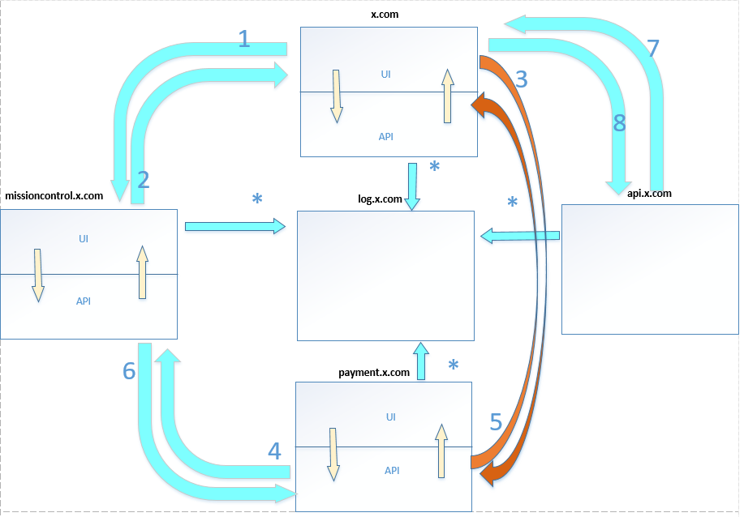

Ana Sayfa
========
Terra, bir yazılım geliştirme framework’udur. Bu framework içerisinde öncelikle nuget paketleri mevcuttur. Bu paketlerde hem mimarinin çalışması, hemde hayatın kolaylaştırılması için gerekli tüm yapılar mevcuttur. Her geçen günde yeni ihtiyaçlar doğrultusunda paketler güncellenmektedir.
Çalışma yapısı olarak Micro Services yapısı göz ününde bulundurularak bir mimari inşa edilmiştir. Mimari içerisinde her uygulama çok temelde API ve UI uygulaması olarak 2 farklı şekilde yapılmaktadır. Tüm uygulamalar, diğer uygulamaların API’ları üzerinden rahatlıkla data çekebilmektedir. Authentication olarak ise, SSO(Single Sign On) bir yapı mevcut olduğu için, tüm uygulamalar çok rahat bir şekilde kendi aralarında iletişime geçebilmektedir.
Proje Mimarisi olarak, Core,Data,Contract,Api,WebUI katmanları mevcuttur.

Core
--------
Tüm uygulamada kullanılacak ortak yapıların tanımlandığı bölümdür.

Contract
--------
Bu yapı projenin API ve UI kısmının kendi arasında haberleşmesini ve diğer uygulamalarında bu API ile iletişime geçebilmesi için gerekli olan yapıdır. İçerisinde Dto ve Interface’leri barındırır. Bu Interface’ler API tarafından implemente edilmektedir.

Data
--------
DB ile erişim için gerekli olan yapıdır. Bu yapıyı API kullanarak DTO’ya çevirerek uygulamalara hizmet etmektedir.

API
--------
Bu yapı ise uygulamadaki tüm Logiclerin tanımlandığı ve uygulandığı yapıdır. Bu yapı tümüyle Authentication gerektirir. Valid Access Token’ı olmayan hiçbir request’e cevap veeremez.

UI
--------
Bu yapı ise Kullanıcıların gördükleri ve kullandıkları yapıdır. API üzerinden data alışverişinde bulunur. Authentication için MissionControl üzerinden Authentication gerektirir.

Çalışma Şekli
--------

İlk request UI uygulamasına geldikten sonra, otomatik olarak MissionControl üzerine yönlendirilerek Authenticate olması sağlanır. Devamında ise MissionControl üzerinden dönen AccessToken ile, API'lara giderek data alışverişi sağlanır. Devamında kullanıcı aynı sistem içerisindeki başka bir uygulamaya gitmeye çalışırsa yeniden MissionControl üzerine gelir. Bu sefer zaten Authenticate olduğu için, dire AccessToken alarak devam eder. Böylelikle tüm uygulamalar tek bir Authentication ile çalışabilmiş olurlar.

Yukarıdaki Şemaya Ait Senaryo :

1. İstekte bulunan URL ClientID ve ClientKey ile birlikte kimlik.x.com a gider. Bunun amacı uı.x.com a gelen isteğin buraya ulaşmasına      izninin olup olmayacağının belirlenmesidir.
2. kimlik.x.com belirli claimsleri kullanarak UI a bir token üretir. 
3. x.com dan herhangi bir ödeme yapılmak istendiğinde payment.x.com istek atılır. 
5. payment.x.com a gelen istek kimlik.x.com dan gerekli izne sahip mi diye sorgulanır
4. Gelen token ile birlikte x.com fail,success, reject olarak cevap dönülür.
6. Gerekli olan token payment.x.com a verilir.
7. x.com dan pdf, text, excel çıktısı istendiğinde api.x.com a istek gider.
8. Oluşturulan çıktı  json formatında cevap gelir. 
*. kimlik.x.com, api.x.com, payment.x.com da olan tüm işlemler için log.x.com a kayıt atılır.

