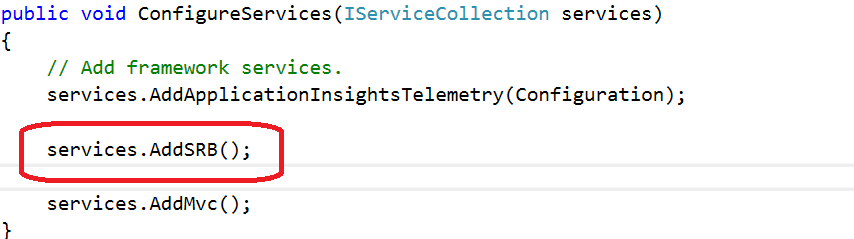
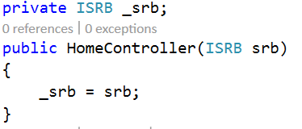
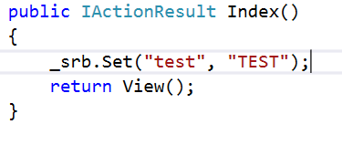
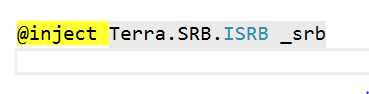
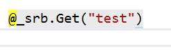

SRB
========

Terra.Framework içerisinde cache mekanizmasının çalışmasını sağlayan katmandır.

Kurulum
--------

Terra.SRB Paketini PackageManager Console' dan aşağıdaki komutu yazarak indirebilirsiniz::

    $ Install-Package Terra.SRB -Version 1.0.0-pre-alpha -Source http://10.10.0.237/nuget/Default

Ve ya Baslarken_ bölümünde yazılan adımları yaptıysanız NuGet'ten *Terra.SRB* yi aratarak Terra.SRB yi bulup Terra.SRB'yi indirebilirsiniz.

.. _Baslarken: http://terradoc.readthedocs.io/en/latest/Baslarken.html

    
Kullanımı
---------
Açtığınız ASP.NET Core Web uygulamasının startup.cs dosyasına aşağıdaki şekilde ekleyiniz.

Daha sonra herhangi bir controller'ın constructorı içinde şekildeki gibi implemente ediyoruz.

Artık terra.srb' yi kullanabiliriz. Hemen aşağıdaki örnekte olduğu gibi.

Viewlarda kullanabilmek için açtığımız projenin Views/Shared klasörünün altındaki *_ViewImports.cshtml* dosyasında aşağıda yazan satırı ekliyoruz.

Şimdi bir de bir tane View da *set* ettiğimiz *get* edip değeri çağıralım.

İletişim
----------

- Issue Tracker: github.com/$project/$project/issues
- Source Code: github.com/$project/$project

Destek
-------

If you are having issues, please let us know.
We have a mailing list located at: project@google-groups.com

